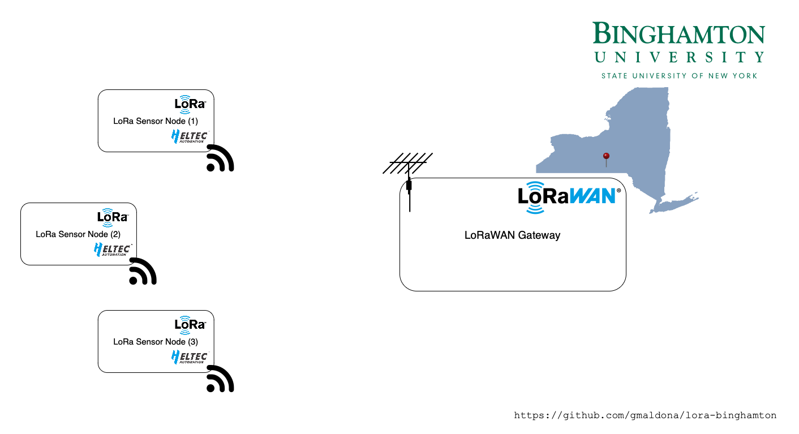

# Analysis of LoRa/LoRaWAN Under Varied Environmental Conditions within the Southern Tier Region of New York State

 

[LoRa (Long Range)](https://www.semtech.com/lora) is a wireless modulation technique which operates on sub-gigahertz bands designed for low bitrate and long distance wireless communication. On the other hand, LoRAWAN is a Media Access Control protocol which defines how LoRa devices communicate. Our project aims to evaluate LoRa/LoRaWAN transmission bitrate and error rates to assess the technology’s reliability within the [Binghamton, NY region](https://maps.app.goo.gl/15VHVsXfRkMjXdqM7) - a region known for its dense forests and mountainous terrain potentially interfering with LoRa/LoRaWAN transmissions and receptions.



[Full Project Abstract](docs/binghamton-lora-abstract.pdf)

## Connecting a LoRa device to a LoRaWAN gateway

In the [platformio.ini](./platformio.ini) file, update `LoRaWAN_devEui`, `LoRaWAN_appEui`, and `LoRaWAN_appKey` with the respective keys that were creating during device registration. The expected values are comma delimited - 2 hex value strings e.g.

```bash
-D LoRaWAN_devEui="0x00, 0x00, 0x00, 0x00, 0x00, 0x00, 0x00, 0x00"
-D LoRaWAN_appEui="0x00, 0x00, 0x00, 0x00, 0x00, 0x00, 0x00, 0x00"
-D LoRaWAN_appKey="0x00, 0x00, 0x00, 0x00, 0x00, 0x00, 0x00, 0x00, 0x00, 0x00, 0x00, 0x00, 0x00, 0x00, 0x00, 0x00"
```

**DO NOT** commit `platformio.ini` after the keys are added. To ignore further changes of `platformio.ini`, the developer can use the git command `git update-index --assume-unchanged platformio.ini` so the file does not show up in the git stage area after changes are made. 

If the keys are accidentally committed, roll back the last commit and force push so the keys do not show up in the git history.

## Connecting the Payload Decoder to The Things Network (TTN)

TODO

### Running the Docoder

Run `./venv.sh` to create a python virtual environment and download the requirements. Activate the environment using `source venv/bin/activate` before running the python script.

`cd` into `python/ttn-mqtt` and run the python script using `./main.py` to run the decoder.

## Contributors:
+ Annie Wu
+ Callisto Hess
+ Gregory Maldonado

Under the advisement of Dali Ismail, Ph.D. at Binghamton University, State University of New York, Thomas Watson College of Engineering and Applied Science.
2024.
## Resources:
+ [Semtech](https://www.semtech.com)
+ [Semtech LoRa Technology Overview](https://www.semtech.com/lora)
+ [The Things Network](https://www.thethingsnetwork.org)
+ [School of Computing, Binghamton University](https://www.binghamton.edu/computer-science/)
